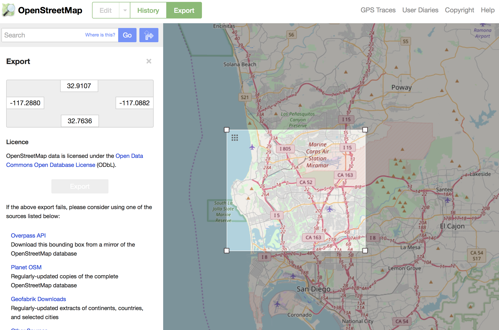

# Data Wrangling on OpenStreetMap Data (San Diego Area)

### Area Description
San Diego, California. 

I spent the most memorable years in San Diego. It's considered as my second hometown. The city is beautiful and diverse in all aspects, excluding the weather, of course.

https://www.openstreetmap.org/export#map=11/32.8433/-117.0607

### Problems Encountered
All the cleaning is about minutia. Most of them can be treated individually.

- Typos and inconsistent names:
  1. Minor typos in city names: ('San Diego,')
  1. Inconsisitent state name: ('CA', 'California', 'ca')
  1. Inconsistent street types: ('Balboa Ave' vs. 'Balboa Avenue', 'Baker St' vs. 'Baker Street', 'Fay Ave' vs. 'Fay Avenue', etc.)
  1. Inconsistent type names of postal code: ('zipcode', 'postcode')
  1. Incorrect zipcodes: {'value': '921009', 'type': 'addr', 'id': '276388373', 'key': 'postcode'}
 

- Swapped entries of zipcode and street name:  
{'value': '10006', 'type': 'addr', 'id': '132979649', 'key': 'housenumber'}  
{'value': 'Scripps Ranch Blvd.', 'type': 'addr', 'id': '132979649', 'key': 'postcode'}  
{'value': '92131', 'type': 'addr', 'id': '132979649', 'key': 'street'}  
{'value': 'yes', 'type': 'regular', 'id': '132979649', 'key': 'building'}  

- Some streets probably should be categorized as "full" instead of just "street" name:  
('10511 Caminito Alvarez', '3020 Childrens Way 03 Mi S Of I-805 / Kearny Villa Ic', '5196 Governor Drive Nw Quad I-805 / Governor Drive Ic', '7181 Opportunity Road', '8002 Gilman Dr 01 Mi Nw I-5 / Gilman Dr Ic')

### Verified Attributes
1. All the longitudes and latitudes are within the range of [-117.08, -117.28], [32.76, 32.92].

### Expand the "expected" street types list, and the "mapping" dictionary

After auditing the street types of the OSM file, I added several street types which are pretty common in this area, such as: "Circle", "Point", "Row", "Terrace", "Walk", "Way", to the "expected" list. Also, the mapping dictionary is updated. All the typos and abbreviation of street types will be treated together.

Then I test running the update to see if the transformation/normalization works as expected.

### Swapped entries corrected in csv file

Since this error/typo is quite case specific, it's easier to look up the issue (they share the same ways.id) in the csv file and then make updates directly.

### Overview of the Data

#### File Sizes
> sandiego.osm - 100.6MB  
> nodes.csv - 29.6MB  
> nodes_tags.csv - 18.7MB  
> ways.csv - 2.3MB  
> ways_nodes.csv - 8MB  
> ways_tags.csv - 6MB  
> sandiego.db - 59MB

#### Number of nodes
> SELECT COUNT(*) FROM nodes;  

360582

#### Number of ways
> SELECT COUNT(*) FROM ways;  

38477

#### Number of unique users
> SELECT COUNT(DISTINCT uid) FROM  
> (SELECT uid FROM nodes UNION SELECT uid FROM ways) AS subq;

628

#### Number of atms
> SELECT COUNT(*) FROM nodes_tags
> WHERE key = 'amenity' and value = 'atm';

31

### Additional Exploration
#### Top 3 banks who set up the most atms
Following the previous statistics, I'm curious that which banks are most likely to install atm machines.
> SELECT aa.value AS Operator, count(aa.id) AS num  
FROM (SELECT nodes_tags.id AS tt FROM nodes_tags WHERE key = 'amenity' AND value = 'atm') AS sub  
JOIN nodes_tags AS aa ON sub.tt = aa.id  
WHERE aa.key = 'operator'  
GROUP BY aa.value  
ORDER BY num DESC  
LIMIT 3;  

Operator|num
---|---
"Wells Fargo"|6
"Bank of America"|4
"Nautilus Hyosung"|4

The numbers are much less than I expected. I highly suspect the data is not complete.

#### Top 10 popular  cuisines in restaurants
> SELECT aa.value AS Cuisine, COUNT(aa.id) AS num 
FROM (SELECT nodes_tags.id AS tt FROM nodes_tags WHERE key = 'amenity' AND value = 'restaurant') AS sub  
JOIN nodes_tags AS aa ON sub.tt = aa.id  
WHERE aa.key = 'cuisine'  
GROUP BY aa.value  
ORDER BY num DESC  
LIMIT 10;

Cuisine|num
---|---
pizza|21
mexican|14
chinese|13
american|12
japanese|10
thai|10
sushi|9
italian|8
burger|6
indian|5

Everyone loves pizzas, and of course mexico is right next door!

#### The most modified nodes
> SELECT nodes.id, nodes_tags.key, nodes_tags.value, nodes.version FROM nodes LEFT JOIN nodes_tags  
ON nodes.id = nodes_tags.id  
ORDER BY version DESC  
LIMIT 10;

nodes.id|nodes_tags.key|nodes_tags.value|nodes.version
---|---|---|---
60632894|||17
60533001|||16  
60632893|||16  
145588850|||16  
288449058|||16  
310978181|||16  
288449057|||15  
319438613|highway|stop|14  
49751676|highway|motorway_junction|13  
49751676|ref|21|13  
The most modified nodes were edited 17 times. 2 nodes here are highway stops/junctions. The top 7 don't have any tags associated. So another JOIN is performed to see if they're nodes along ways.

>SELECT nodes.version, nodes.id, ways_nodes.position, ways_nodes.id, ways_tags.value  
FROM nodes LEFT JOIN ways_nodes ON nodes.id = ways_nodes.node_id JOIN ways_tags ON ways_nodes.id = ways_tags.id  
WHERE ways_tags.key = 'name'  
ORDER BY version DESC  
LIMIT 10;  

nodes.version|nodes.id|ways_nodes.position|ways_nodes.id|ways_tags.value
---|---|---|---|---
17|60632894|20|313201101|"San Diego Northern Railway"  
16|60533001|0|102698586|Green  
16|60533001|27|159338263|Green  
16|60632893|17|313201101|"San Diego Northern Railway"  
16|288449058|24|313201101|"San Diego Northern Railway"  
16|310978181|11|358587259|"San Diego Northern Railway"  
15|288449057|27|313201101|"San Diego Northern Railway"  
14|319438613|0|29043282|"Justice Lane"  
14|319438613|6|331955334|"Voigt Drive"  
13|49751676|2|25863005|"San Diego Freeway"  

Since one nodes may have multiple tags and appear on multiple routes, so duplicate id's still make sense. These nodes are revised most often probably because of the on-going downtown infrastructure construction, leading to detours frequently. The "Green" actually means the Green Line Trolley in downtown San Diego area, which connects several sightseeing spots, highly recommend!

### Ideas for Improvements and Suggestions

#### FIXME issue
Noticeably there're a bunch of "FIXME" and "fixme" keys. First I update all the "fixme" to be "FIXME" by

> UPDATE nodes_tags SET key = 'FIXME' WHERE key = 'fixme';  
> UPDATE ways_tags SET key = 'FIXME' WHERE key = 'fixme'

I should have done that before the data transportaion. But this happens in real life that some flaws don't show up until it's accidentally encountered. So I decided keep going.

Then,
> SELECT * FROM nodes_tags WHERE key = 'FIXME';

Some Results are as follows,

1423657933,FIXME,"is this a playground?"  
1423658080,FIXME,"looks like this is a skatepark. confirm"  
1474749189,FIXME,"find name"  
1637062320,FIXME,"don't know exact name ofthis place"  
2120326491,FIXME,"tiger had this road here but no idea where it really is"  
2129886368,FIXME,"where is this road? tiger not right based on bing maps"

#### Suggestions
These entries are spots that need verification from locals or some research from users. I'm thinking of two ways to solve this problem.
1. Prohibit such tags to be created in the first place. Users are only allowed to enter valid information by making essential fields mandatory or setting up constraints on certain fields. This encourages users to double think/check what they provide. But this may also turn down some users from building up new entities unless they're 100% sure.
1. These ambiguious places could be highlighted on OpenStreetMap APP/website when people search for the particular area, with question marks or hover on the side bar, inducing users to investigate and provide more accurate results. However, in this case, some ghost towns may never be discovered or corrected. A reward system, such as earning points, or taking the mayorship of the place of interest, will encourage users to involve.

#### Full address
As mentioned at the beginning, some addresses are labeled as "street", but actually contain the full addresses and even the crossing road. While another label "full" flags several full addresses. Whether the "full" label is necessary or not is unconfirmed, communications with OpenstreetMap may be required to make such decisions.

### Conclusion

The data is not complete, even with a lot contributors. Some cleaning need further confirmation, although it doesn't affect the queries performed in this exercise. We can still extract plentiful information from the existing data.

### References

https://docs.python.org/2/library/re.html  
https://docs.python.org/2/library/xml.etree.elementtree.html  
https://wiki.openstreetmap.org/wiki/Key:amenity#Sustenance  
https://gist.github.com/carlward/54ec1c91b62a5f911c42#file-sample_project-md  
https://www.w3schools.com/sql/default.asp

and the Udacity Data Wrangling course materials.
